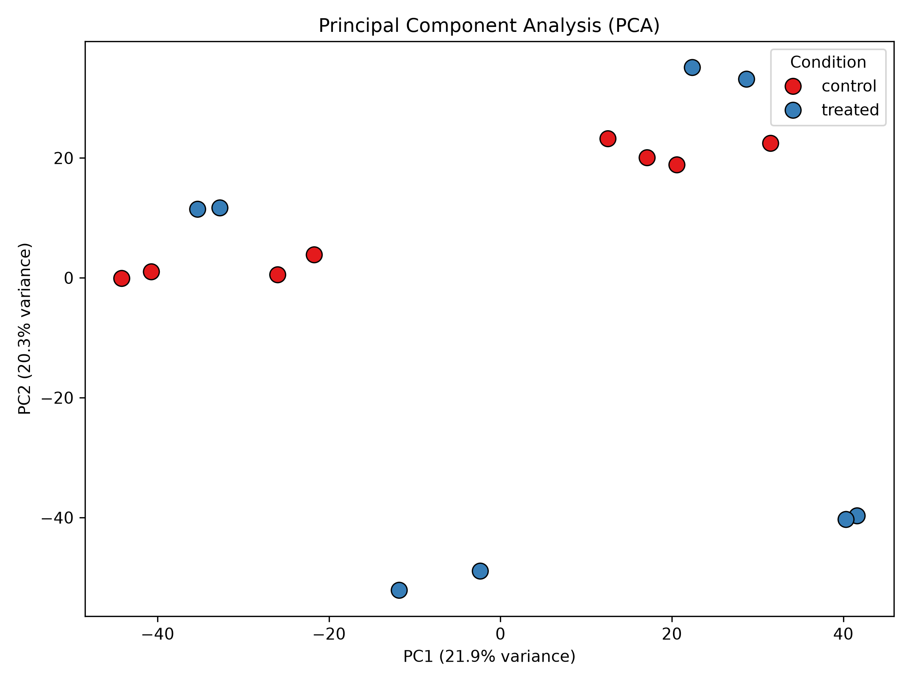
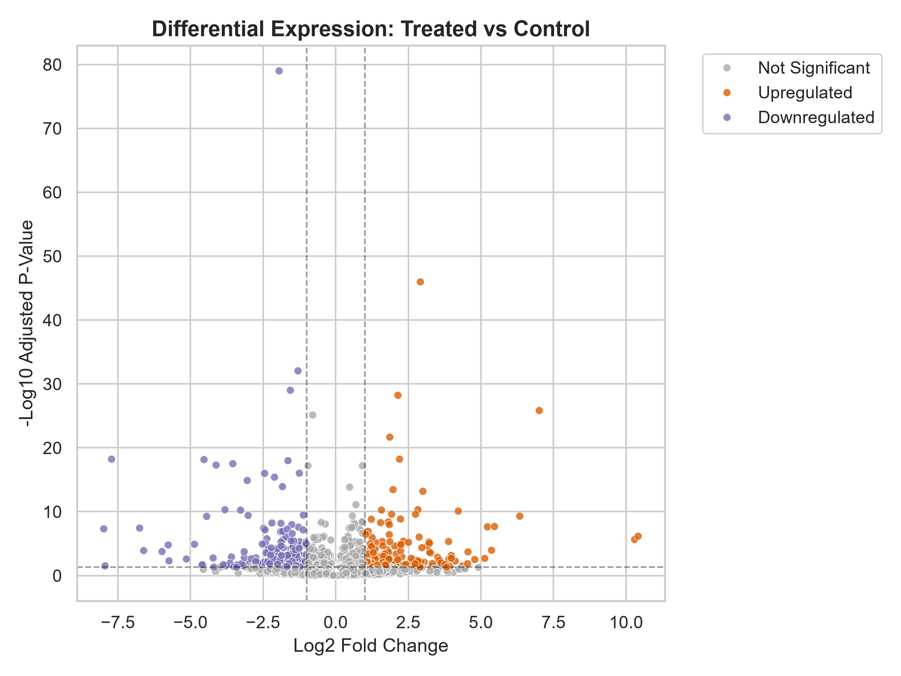

## Results & Visualizations

### Principal Component Analysis (PCA)
Global sample variance and clustering based on log-transformed, size-factor normalized counts.



### Volcano Plot
Differential expression significance mapping highlighting genes meeting the false discovery rate ($p_{\text{adj}} < 0.05$) and log2 fold-change thresholds ($|\text{LFC}| > 1$).



Markdown
# GSE52778 RNA-Seq Differential Expression Pipeline

A reproducible, automated Python pipeline for end-to-end transcriptomic analysis using **PyDESeq2** and **scikit-learn**. This workflow processes raw RNA-Seq count data from NCBI GEO (Dataset: GSE52778), fits a generalized linear model for differential gene expression, and generates publication-grade Quality Control (PCA) and result (Volcano) visualizations.

---

## Project Structure

```text
geo-rnaseq-pipeline/
│
├── data/                    # Raw count matrices and auto-generated metadata
│   ├── metadata.csv         # Experimental design matrix
│   └── ...                  # Raw count files (.csv, .tsv, .txt)
│
├── outputs/                 # Generated plots and analytical results
│   ├── pca_plot.png         # Sample-level PCA variance plot
│   ├── volcano_plot.png     # Differential expression volcano plot
│   └── differential_expression_results.csv # Full statistical table
│
├── pipeline.py              # Main automated execution script
└── README.md                # Project documentation

```
Requirements & Dependencies
This pipeline requires Python 3.10+ and the following core libraries:

pydeseq2

pandas

numpy

matplotlib

seaborn

scikit-learn

You can install the dependencies via pip:

Bash
pip install pydeseq2 pandas numpy matplotlib seaborn scikit-learn
Usage
Place your extracted raw count file inside the data/ folder.

Run the automated analysis pipeline from your terminal:

Bash
python pipeline.py
Check the outputs/ folder for generated statistics and visual assets.

Results & Visualizations
1. Principal Component Analysis (PCA)
Performs size-factor normalization and log-transformation to evaluate global variance and sample clustering.

2. Volcano Plot
Highlights statistically significant differentially expressed genes based on false discovery rate (padj < 0.05) and log2 fold-change thresholds (|LFC| > 1).

Author
Ali Al-Jumaili

BSc Biomedical Science | University of Surrey
